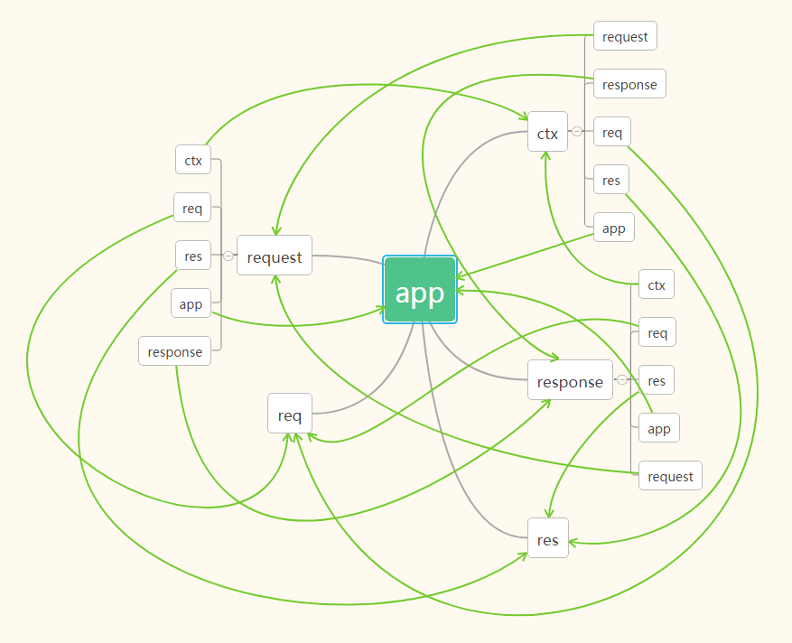

## 介绍
> Heysoo 基于 koa 进行二次开发，因此具有 koa 拥有的所有 [API](http://koajs.com)，以下 API 是 Heysoo 框架特有的 API。
同名的 API 以 Heysoo 的 API 为准。

### Koa 架构图
> 在深入了解 API 之前，你必须对 Koa 的架构有基本的了解，简单如下：




## application
> Heysoo 实例相关API

```js
const app = new Heysoo();
```

### 属性

#### app._version
当前版本

#### app._author
作者

#### app._config
当前配置

### 方法

#### app.start
**简介** 启动 Heysoo 应用

**定义** `app.start(config)`

**参数** 

`config | Object | {} | 应用配置`

**注意** 如果传入了 config 参数，将会覆盖掉 `config.js` 原有的参数设置。
<br><br>
#### app.hook
**简介** 应用钩子，钩子是一个很强大的功能，你可以通过该特性向 Heysoo 添加自己的插件。app.hook 不同于 app.use，它只会在应用启动时执行一次。

#### app.getConfig
**简介** 获取当前配置


## context

### context.debug

### 别名 API
#### response 相关别名 API
```js
context.done
context.doneWithError
context.download
context.json
context.render, context.display
context.send
context.with
context.withStatus
context.withHeader, context.withHeaders
```


## request
> 请求相关 API

### 方法

#### request.input
**简介** 获取表单参数

**定义** `request.input(name,defaultValue)`

**参数** 

`name | String | '' | 参数名称`

`defaultValue | Any | null | 参数不存在时返回的默认值`


## response
> 响应相关 API，支持链式调用。

### response.done
**简介** 结束请求并输出数据

**别名** `context.done`

**定义** `response.done(data,errorLevel,msg)`

**参数** 

`data | Any | null | 发送的数据`

`errorLevel | Integer | 0 | 错误级别，0 无错误，1 提示，2 警告，3 错误`

`msg | String | null | 携带的信息`

**示例** 

```js
const data = 'hello';
this.ctx.done(data);
```
**输出**
```js
{
	err: {
		level: 0, // 错误级别
		msg: '' // 说明信息
	},
	data: 'hello'
}
```
<br><br>
### response.doneWithError
**简介** 结束请求并输出错误信息，等同于 `this.ctx.done(null,3,errMsg)`

**别名** `context.doneWithError`

**定义** `response.doneWithError(errMsg)`

**参数** 

`errMsg | String | null | 错误信息`

**示例** 
```js
const err = new Error('error info');
this.ctx.doneWithError(err.toString());
```
**输出**
```js
{
	err: {
		level: 3,
		msg: 'error info'
	},
	data: null
}
```
<br><br>
### response.download
**简介** 下载文件

**别名** `context.download`

**定义** `response.download(filePath)`

### response.json
**简介** 输出一个 JSON 对象

**别名** `context.json`

**定义** `response.json(json)`
<br><br>
### response.render
**简介** 页面输出

**别名** `context.render, context.display, response.display`

**定义** `response.render(viewPath,params)`

**参数** 

`viewPath | String | null | 模板路径`

`params | Object | {} | 模板参数`

**注意** 这是一个异步操作，使用时记得加上 await `await this.ctx.render('index.html')`
<br><br>
### response.send
**简介** 简单的数据输出，`this.ctx.body = data` 的简单封装

**别名** `context.send`

**定义** `response.send(data)`
<br><br>
### response.with
**简介** <span class="badge badge-primary">chain</span> 响应设置

**别名** `context.with`

**定义** `response.with(setting)`

**参数** 

`setting | Object | {} | 设置`

**可设置项**<br/>
`status` HTTP 状态码<br/>
`header || headers` HTTP 头部

**示例** 
```js
this.ctx.with({
	status: 200,
	header: {
		'Content-Type': 'application/json'
	}
}).send();
```
<br><br>
### response.withStatus
**简介** <span class="badge badge-primary">chain</span> 设置 HTTP 状态码，等同于 `this.ctx.status = statusCode`

**别名** `context.withStatus`

**定义** `response.withStatus(statusCode)`
<br><br>
### response.withHeader
**简介** <span class="badge badge-primary">chain</span> 设置HTTP 头部

**别名** `response.withHeaders, context.withHeader, context.withHeaders`

**定义** `response.withHeader(header)`

**参数** 

`header | Object | {} | HTTP 头部`

**示例** 
```js
this.ctx.withHeader({
	'Content-Type': 'application/json'
}).send();
```


## router
> 路由相关 API

## logger
> 日志相关 API

## util
> 辅助工具 API

### toFixed
**简介** 数字精度控制，类似 `Number.prototype.toFixed`，但最终结果还是数字而不是字符串。

**示例** 
```js
console.log((12.3456).toFixed(2));
```
**输出**
```js
12.35
```